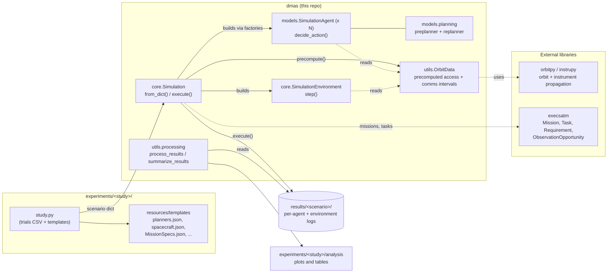
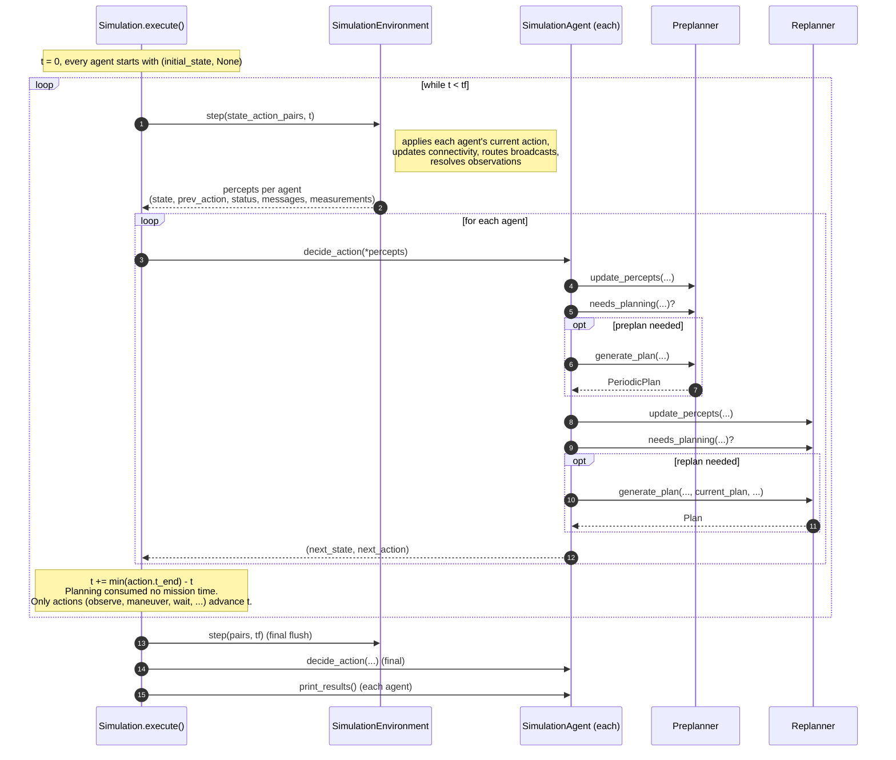
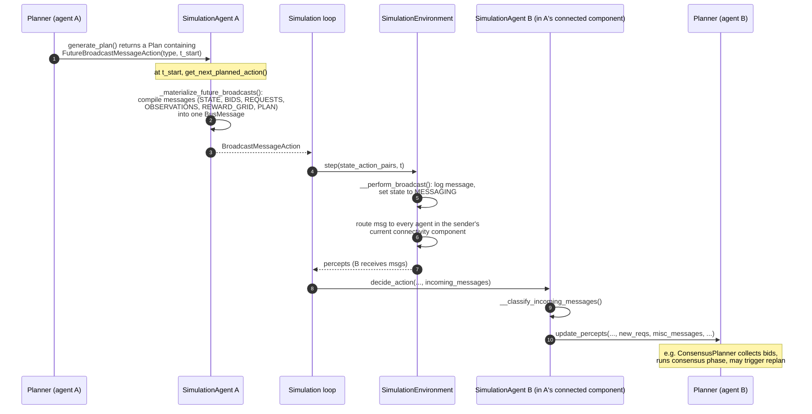

# DMAS Architecture

This page documents the synchronous DMAS implementation (`dmas/`). The `network/` package
(asynchronous execution) is under development and is **not** covered here. Diagram sources live in
`docs/diagrams/uml/*.mmd` (Mermaid, rendered natively by GitHub).

## 1. System context
What `dmas` is built from and what it produces.

- `Simulation.from_dict()` turns a scenario dictionary into agents, an environment, and precomputed orbit data.
- Orbit propagation and instrument models come from `orbitpy` / `instrupy`. Missions, tasks, requirements and
  observation opportunities come from `execsatm`.
- Results are written per agent under the scenario results directory. `utils/processing.py` reads them back for analysis.

## 2. Planner class hierarchy (the extension point)
Every agent holds at most one **preplanner** (`AbstractPeriodicPlanner`) and at most one **replanner**
(`AbstractReactivePlanner`). Both derive from `AbstractPlanner`. To add an autonomy approach you subclass one of them
(see [ADDING_A_PLANNER.md](ADDING_A_PLANNER.md)).

```mermaid
classDiagram
    direction TB

    class SimulationAgent {
        +decide_action(curr_state, prev_action, prev_status, incoming_messages, my_measurements) (state, action)
        +get_next_planned_action(state) AgentAction
        -_plan : Plan
        -_known_tasks
        -_observations_tracker
    }

    class AbstractPlanner {
        <<abstract>>
        +update_percepts(...)*
        +needs_planning(...) bool*
        +generate_plan(...) Plan*
        +print_results()*
        +calculate_access_opportunities()
        +create_observation_opportunities_from_accesses()
        +estimate_observation_opportunity_value()
        +is_observation_path_valid()
    }

    class AbstractPeriodicPlanner {
        <<abstract>>
        horizon, period, sharing
        +needs_planning(state, specs, plan) bool
        +generate_plan(state, specs, orbitdata, mission, tasks, obs_history) PeriodicPlan
        #_schedule_observations(...) list*
        #_schedule_broadcasts(...) list*
    }

    class AbstractReactivePlanner {
        <<abstract>>
        +update_percepts(...)*
        +needs_planning(...) bool*
        +generate_plan(state, specs, current_plan, orbitdata, mission, tasks, obs_history) Plan*
    }

    AbstractPlanner <|-- AbstractPeriodicPlanner
    AbstractPlanner <|-- AbstractReactivePlanner
    SimulationAgent o-- "0..1" AbstractPeriodicPlanner : preplanner
    SimulationAgent o-- "0..1" AbstractReactivePlanner : replanner

    %% Periodic family
    class HeuristicInsertionPeriodicPlanner
    class EarliestAccessPeriodicPlanner
    class EarliestRequestArrivalPeriodicPlanner
    class NadirPointingPeriodicPlanner
    class DynamicProgrammingPlanner
    class BlankPlanner
    class AbstractEventAnnouncerPlanner {
        <<abstract>>
    }
    class InstantEventAnnouncerPlanner
    class GroundProcessorEventAnnouncerPlanner
    class DealerPlanner
    class DealerMILPPlanner
    class TestingDealer
    class WorkerPlanner

    AbstractPeriodicPlanner <|-- HeuristicInsertionPeriodicPlanner
    HeuristicInsertionPeriodicPlanner <|-- EarliestAccessPeriodicPlanner
    HeuristicInsertionPeriodicPlanner <|-- EarliestRequestArrivalPeriodicPlanner
    EarliestAccessPeriodicPlanner <|-- NadirPointingPeriodicPlanner
    AbstractPeriodicPlanner <|-- DynamicProgrammingPlanner
    AbstractPeriodicPlanner <|-- BlankPlanner
    AbstractPeriodicPlanner <|-- AbstractEventAnnouncerPlanner
    AbstractEventAnnouncerPlanner <|-- InstantEventAnnouncerPlanner
    AbstractEventAnnouncerPlanner <|-- GroundProcessorEventAnnouncerPlanner
    AbstractPeriodicPlanner <|-- DealerPlanner
    DealerPlanner <|-- DealerMILPPlanner
    DealerPlanner <|-- TestingDealer
    AbstractPeriodicPlanner <|-- WorkerPlanner

    %% Reactive family
    class HeuristicInsertionReactivePlanner
    class EarliestAccessReactivePlanner
    class EarliestRequestArrivalReactivePlanner
    class NadirPointingReactivePlanner
    class FixedPointingDefaultPlanner
    class ConsensusPlanner {
        <<abstract>>
        #_bundle_building_phase(...)*
        #_build_bundle_from_preplan(...)*
    }
    class HeuristicInsertionConsensusPlanner
    class AugmentedConsensusPlanner
    class AugmentedHeuristicInsertionConsensusPlanner

    AbstractReactivePlanner <|-- HeuristicInsertionReactivePlanner
    HeuristicInsertionReactivePlanner <|-- EarliestAccessReactivePlanner
    HeuristicInsertionReactivePlanner <|-- EarliestRequestArrivalReactivePlanner
    EarliestAccessReactivePlanner <|-- NadirPointingReactivePlanner
    AbstractReactivePlanner <|-- FixedPointingDefaultPlanner
    AbstractReactivePlanner <|-- ConsensusPlanner
    ConsensusPlanner <|-- HeuristicInsertionConsensusPlanner
    ConsensusPlanner <|-- AugmentedConsensusPlanner
    HeuristicInsertionConsensusPlanner <|-- AugmentedHeuristicInsertionConsensusPlanner
    AugmentedConsensusPlanner <|-- AugmentedHeuristicInsertionConsensusPlanner

    %% Plans
    class Plan {
        <<abstract>>
        +add(action, t)
        +get_next_actions(t)
        +update_action_completion(...)
    }
    class PeriodicPlan
    class ReactivePlan
    Plan <|-- PeriodicPlan
    Plan <|-- ReactivePlan
    AbstractPlanner ..> Plan : generate_plan returns
```

Note: `ConsensusPlanner` (the SC-CBBA family) and the centralized planners live in folders without an `__init__.py`,
so tools such as `pyreverse` skip them; they are drawn here from the source.

## 3. Simulation loop
The loop is synchronous and event-driven. Mission time `t` advances **only** to the earliest end time of the actions the
agents chose. Planner computation (including consensus) advances no mission time; it costs wall-clock time only.

## 4. Inside `SimulationAgent.decide_action`
The per-agent decision cycle. This is where your planner is called.

```mermaid
flowchart TD
    start(["decide_action(curr_state, prev_action, prev_status,<br/>incoming_messages, my_measurements)"])
    s1["Update state + state history"]
    s2["Classify incoming messages:<br/>task requests, external observations,<br/>reward grids, states, action statuses, misc"]
    s3["Process action completion<br/>(completed / aborted / pending)"]
    s4["Update known tasks + requests"]
    s5["Update plan completion"]
    s6["Process own measurements<br/>(may generate new task requests)"]
    s7["Update observation history + tracker<br/>(own + external observations)"]
    pre{"preplanner<br/>assigned?"}
    pre1["preplanner.update_percepts()"]
    pre2{"preplanner.<br/>needs_planning()?"}
    pre3["preplanner.generate_plan()<br/>-> new PeriodicPlan"]
    re{"replanner<br/>assigned?"}
    re1["replanner.update_percepts()"]
    re2{"replanner.<br/>needs_planning()?"}
    re3["replanner.generate_plan(current_plan)<br/>-> repaired Plan"]
    n1["get_next_planned_action():<br/>next actions from plan,<br/>materialize FutureBroadcast actions,<br/>attach observation requests, validate"]
    n2["Prepare next state for the chosen action"]
    done(["return (next_state, next_action)"])

    start --> s1 --> s2 --> s3 --> s4 --> s5 --> s6 --> s7 --> pre
    pre -- yes --> pre1 --> pre2
    pre -- no --> re
    pre2 -- yes --> pre3 --> re
    pre2 -- no --> re
    re -- yes --> re1 --> re2
    re -- no --> n1
    re2 -- yes --> re3 --> n1
    re2 -- no --> n1
    n1 --> n2 --> done
```

## 5. Message flow between agents
Planners do not send messages directly. They schedule `FutureBroadcastMessageAction`s in their plan; the agent compiles
the message contents when the action comes due; the environment delivers them.

Delivery in `SimulationEnvironment.step()` goes to every agent in the sender's *current* connectivity component, taken
from the precomputed `comms_links` intervals in `OrbitData`.
